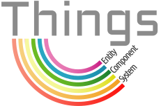

_Things serves as one of the building blocks for [an open-source game about
space engineering and exploration][rkt]. **This library is in active use and
development.**_

[rkt]: https://rustic.games

 

Things aims to be a **safe**, **fast** and **simple** Entity-Component-System
library.

- **safe** — Rust's type system and ownership model prevent data race
  conditions.

- **fast** — Using data-oriented design techniques, the library is focussed on
  high performance use-cases.

- **simple** — small API surface area, focussing on easy interoperability with
  other libraries and design patterns, such as event systems.

---

> "thing"
>
> – An object that one need not, cannot, or does not wish to give a specific
> name to.

**NOTE** this is an experimental crate used for the purpose of learning the
inner workings of an ECS, and being able to "control" one of the key components
of the game I'm working on. If you want to use an ECS library in production, I
would advice you to take a look at either [Pyro][] or [Specs][], which are both
faster, more feature rich, better maintained, and more widely used. Both are
used by me as inspiration while developing Things.

[Pyro]: https://github.com/MaikKlein/pyro
[Specs]: https://github.com/slide-rs/specs
